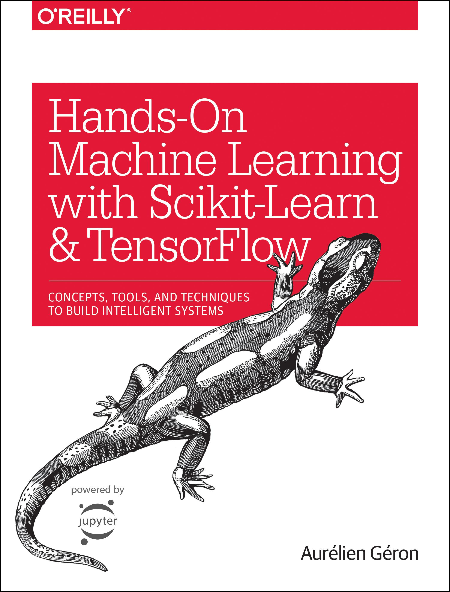

# Overview

Solutions to exercises and experimentation for [Hands-On Machine Learning with
Scikit-Learn and TensorFlow: Concepts, Tools, and Techniques to Build
Intelligent
Systems](https://www.amazon.com/Hands-Machine-Learning-Scikit-Learn-TensorFlow/dp/1491962291)

